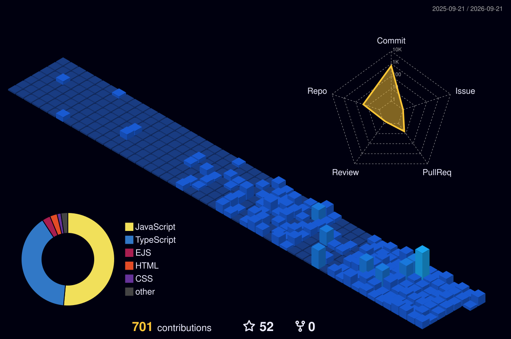

 

  
  
  
  

  
  

 

## About Me

I'm a Full Stack Developer based in Kochi, India, focused on building real-world web applications rather than tutorials — service marketplaces, payment workflows, role-based systems, and admission/workflow tools that hold up under actual usage.

Most of my work sits at the intersection of frontend product thinking and backend architecture. On the frontend, that means React and Next.js interfaces that stay responsive under real data. On the backend, it means designing around Clean Architecture and the Repository Pattern instead of wiring routes directly to a database — so the system stays testable and easy to extend as it grows.

I like problems that force a decision: how a wallet ledger should reconcile, how a multi-role auth system should fail safely, how a modular monolith should be split before it needs to be. Outside of shipped projects, I spend time on DSA and system design, and I'm currently extending that into AI/LLM integration — RAG pipelines, MCP, and agentic tooling — as a new layer on top of the same engineering fundamentals.

 

## Current Focus

<table>
<tr>
<td width="25%" valign="top">

**🔭 Building**

Reviewer Bucket, a community platform for Brototype students, and a production-grade URL Shortener SaaS on NestJS

</td>
<td width="25%" valign="top">

**📚 Learning**

PostgreSQL, NestJS in depth, and applied System Design

</td>
<td width="25%" valign="top">

**🧠 Exploring**

RAG, MCP, and AI-agent integration into real product workflows

</td>
<td width="25%" valign="top">

**💼 Open to**

Full Stack / Frontend roles, and open-source collaboration

</td>
</tr>
</table>

 

## Tech Stack

**Languages**

  

**Frontend**

    

**Backend**

    

**Database**

  

**Architecture**

   

**Cloud & DevOps**

    

**Tools**

  

 

<b>🛠️ Favorite Tools & Environment</b>

 

Docker is a current learning target, not yet in production use.

 

## Featured Projects

| Project | Description | Stack | Live / Case Study | Repository | Status |
|---|---|---|---|---|---|
| **[QuickWork](https://github.com/Ismailkt313/QuickWork)** — flagship | Multi-role local service marketplace: job discovery, provider assignment, HMAC-verified Razorpay payments, wallet & debt-recovery ledger, admin monitoring | React · TypeScript · Node.js · Express · MongoDB · Redux Toolkit · Socket.IO · Razorpay · AWS | [Case Study](https://ismail-kt.vercel.app/projects/quickwork) | [Repo](https://github.com/Ismailkt313/QuickWork) | Production |
| **[AdmissionFlow](https://github.com/Ismailkt313/AdmissionFlow)** | School admission workflow system — parent & admin-team roles, entrance-exam scheduling, score management, course assignment, built on Clean Architecture | Next.js · NestJS · TypeScript · MongoDB · JWT | [Case Study](https://ismail-kt.vercel.app/projects/admissionflow) | [Repo](https://github.com/Ismailkt313/AdmissionFlow) | Completed |
| **[ErrorLens](https://github.com/Ismailkt313/ErrorLens)** | AI debugging assistant that parses runtime stack traces and queries an LLM for root-cause analysis and confidence-scored fixes | React · Node.js · Express · MongoDB · AI APIs | [Case Study](https://ismail-kt.vercel.app/projects/errorlens) | [Repo](https://github.com/Ismailkt313/ErrorLens) | Completed |
| **[TIMZO](https://github.com/Ismailkt313/TIMZO)** | Watch e-commerce platform with order verification, stock tracking, and Razorpay payment checks | Node.js · Express · MongoDB · Razorpay | [Case Study](https://ismail-kt.vercel.app/projects/timzo) | [Repo](https://github.com/Ismailkt313/TIMZO) | Completed |
| **[SyncChat](https://github.com/Ismailkt313/SyncChat)** | Real-time chat application with channel separation, dynamic message distribution, and typing-status indicators | React · Node.js · Express · Socket.IO · JWT | [Case Study](https://ismail-kt.vercel.app/projects/syncchat) | [Repo](https://github.com/Ismailkt313/SyncChat) | Completed |
| **[DevShowroom](https://github.com/Ismailkt313/DevShowroom)** | Shareable developer showcase platform for presenting technical projects with more clarity than a repo list | Next.js · TypeScript · Tailwind CSS · Mongoose | [Case Study](https://ismail-kt.vercel.app/projects/devshowroom) | [Repo](https://github.com/Ismailkt313/DevShowroom) | Completed |
| **[BistroHub](https://github.com/Ismailkt313/BistroHub)** | Restaurant discovery and listing platform with ratings and local dining details | React · Node.js · Express · MongoDB · Bootstrap | [Case Study](https://ismail-kt.vercel.app/projects/bistrohub) | [Repo](https://github.com/Ismailkt313/BistroHub) | Completed |
| **ColdMate** | AI-assisted job-outreach tool organizing company research, resume context, and personalized outreach | Next.js · TypeScript · Node.js · MongoDB · AI APIs | [Case Study](https://ismail-kt.vercel.app/projects/coldmate) | Private | In Progress |
| **Reviewer Bucket** | Community SaaS for Brototype students to discover reviewers, share honest interview experiences, and request missing reviewers | Full-stack (final stack TBA) | — | Private | In Progress |
| **ShortLink (URL Shortener SaaS)** | Authenticated URL shortener with click analytics, link management, and a NestJS backend built on the Repository Pattern | NestJS · MongoDB · React · TypeScript · Vite · Tailwind CSS · TanStack Query | — | Private | In Progress |
| **Watchtower** | AI-native incident command platform (PagerDuty/Opsgenie category) with RAG-assisted triage and an AI postmortem-drafting agent | PostgreSQL · pgvector · BullMQ · Socket.IO · RAG · MCP | — | Private | In Progress |

I have several additional repositories exploring different technologies, concepts, and learning experiments — browse them all in the <a href="https://github.com/Ismailkt313?tab=repositories">repositories tab</a>.

 

## GitHub Analytics

  

  

The snake animation renders after the GitHub Action below runs once — see the setup guide.

 

## 3D Contribution Calendar

Isometric view of your contribution history — height and color track commit volume per day. Renders after the GitHub Action below runs once; see the setup guide for other color variants.

 

## Problem Solving

DSA and algorithmic thinking are a constant background thread alongside project work — not as a separate track, but as the reasoning that shapes how a feature gets architected in the first place: what the access pattern is, where the bottleneck will actually be, and what the simplest correct data structure is before reaching for a clever one.

<!-- Optional — add once you have a public LeetCode handle:

-->

 

## Architecture & Engineering Principles

- **Clean Architecture & Repository Pattern** — business logic stays independent of the framework and the database driver
- **Modular Monolith over premature microservices** — service boundaries that are real but don't cost a network hop yet
- **API design first** — DTOs, validation, and consistent error shapes before the first endpoint ships
- **Maintainability over cleverness** — code that a teammate (or future me) can extend without a rewrite

 

## Open Source & Collaboration

I'm actively looking to contribute to open-source projects in the React/Node.js ecosystem, and I'm open to hackathons and collaborative builds — the fastest way I've found to learn a codebase's real constraints, not just its documentation.

 

### Development Philosophy

> *Good software rarely announces itself as "clever." It shows up as a codebase where the next feature is easy to add and the next bug is easy to find — that's the bar I build toward.*

 

## Let's Connect

  

